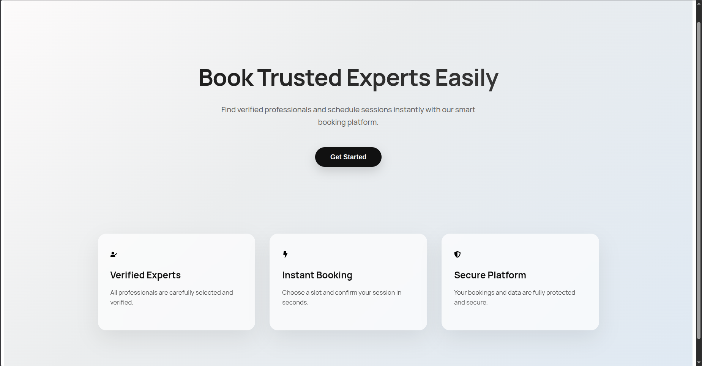
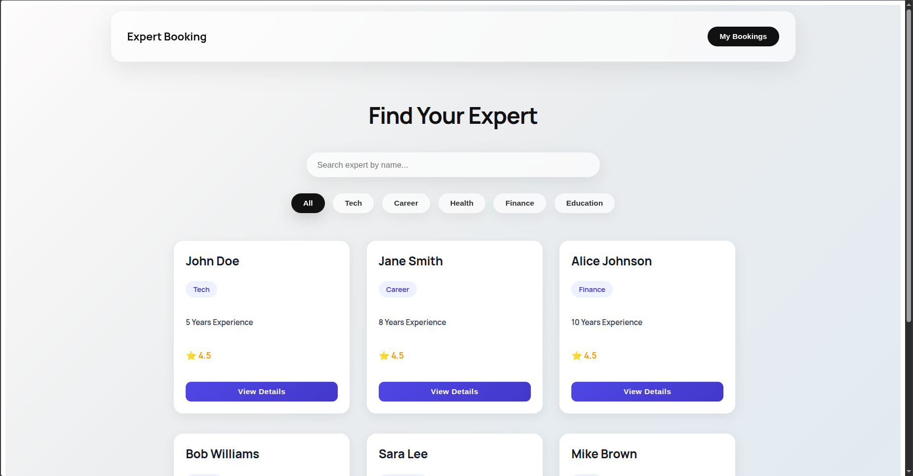
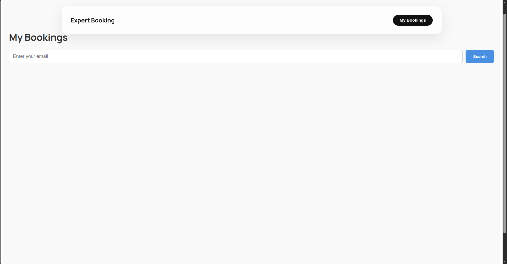

# 💼 Expert Booking App

A modern **Expert Session Booking App** built with **React.js**, **Node.js**, **Express.js**, and **MongoDB**.
This application allows users to explore expert profiles, select available slots, book sessions, and manage bookings efficiently.

---

## 🚀 Features

* 👩‍💼 Browse expert profiles with detailed information
* 🎨 Premium horizontal card UI design
* 📅 Slot selection for booking sessions
* ✅ Secure booking confirmation with optional notes
* 📧 View bookings using email
* 🏷️ Booking status indicators: **Confirmed**, **Pending**, **Completed**
* 🔍 Search bookings by email
* 📱 Fully responsive (mobile + desktop)
* 🧼 Clean and intuitive UI

---

## 🛠️ Tech Stack

### Frontend

* React.js
* React Router
* HTML5
* CSS3

### Backend

* Node.js
* Express.js

### Database

* MongoDB

### API Handling

* Axios / Fetch API

---

## 📂 Project Structure

```id="s8d2ka"
expert-booking-app/
│
├── src/
│   ├── backend/
│   │   ├── models/       
│   │   ├── routes/       
│   │   ├── controllers/  
│   │   └── server.js     
│   │
│   ├── frontend/
│   │   ├── components/   
│   │   ├── pages/        
│   │   ├── public/       
│   │   └── App.js        
│
└── README.md
```

---

## ⚙️ Installation & Setup

### 🔹 1. Clone Repository

```bash id="l3n1kd"
git clone ttps://github.com/PriyankaVerma2307/Expert-project
cd expert-booking-app
```

---

### 🔹 2. Backend Setup

```bash id="g7m9pz"
cd src/backend
npm install
```

Create a `.env` file:

```env id="h9c2xp"
MONGO_URI=your_mongodb_connection_string
PORT=5000
```

Run backend:

```bash id="z5x1lw"
npm run dev
```

---

### 🔹 3. Frontend Setup

```bash id="u3r8ys"
cd ../frontend
npm install
npm start
```

---

## ▶️ Run Application

* Backend runs on:
  http://localhost:5000

* Frontend runs on:
  http://localhost:3000

---

## 📸 Screenshots

### 🏠 Expert Home Page



### 📋 Expert List Page



### 📅 Booking Page



---

## 🎯 Purpose

This project is designed to simulate a real-world expert booking platform where users can easily connect with professionals and manage session bookings.

---

## 🙌 Author

Priyanka

---

## ⭐ Note

This project is built for learning and portfolio purposes.
